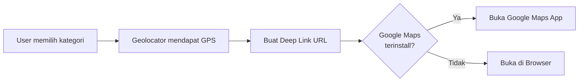

# Dokumen Desain Teknis NutriBunda

## Pendahuluan

Dokumen ini menjelaskan desain teknis aplikasi NutriBunda, sebuah aplikasi mobile Flutter yang berfungsi sebagai asisten pendamping ibu dalam memantau gizi MPASI anak dan diet pemulihan pasca-melahirkan. Aplikasi ini menggunakan arsitektur client-server dengan backend Golang dan database PostgreSQL.

## Stack Teknologi

### Frontend (Flutter)
- **Framework**: Flutter 3.x (Dart)
- **State Management**: Provider/Riverpod
- **Local Storage**: SQLite (sqflite), flutter_secure_storage
- **Authentication**: local_auth (biometric)
- **Sensors**: sensors_plus (accelerometer), pedometer
- **Location**: geolocator, url_launcher
- **Notifications**: flutter_local_notifications
- **HTTP Client**: dio/http

### Backend (Golang)
- **Framework**: Gin/Echo
- **Database**: PostgreSQL dengan GORM
- **Authentication**: JWT dengan bcrypt
- **External APIs**: Gemini API

### Database
- **Server**: PostgreSQL 14+
- **Local**: SQLite 3

---

## Arsitektur Sistem

### High-Level Architecture

```
┌─────────────────┐    HTTP/REST    ┌─────────────────┐    SQL    ┌─────────────────┐
│                 │ ──────────────► │                 │ ────────► │                 │
│  Flutter Client │                 │  Golang Backend │           │   PostgreSQL    │
│                 │ ◄────────────── │                 │ ◄──────── │                 │
└─────────────────┘                 └─────────────────┘           └─────────────────┘
         │                                   │
         │ SQLite                           │ External APIs
         ▼                                   ▼
┌─────────────────┐                 ┌─────────────────┐
│  Local Storage  │                 │  Gemini API     │
│  (Offline Data) │                 │  Google Maps    │
└─────────────────┘                 └─────────────────┘
```

### Flutter Architecture Pattern

Menggunakan **Provider Pattern** dengan struktur:

```
lib/
├── main.dart
├── core/
│   ├── constants/
│   ├── utils/
│   ├── services/
│   └── errors/
├── data/
│   ├── models/
│   ├── repositories/
│   └── datasources/
├── domain/
│   ├── entities/
│   ├── repositories/
│   └── usecases/
├── presentation/
│   ├── providers/
│   ├── pages/
│   ├── widgets/
│   └── themes/
└── injection_container.dart
```

### Dependencies Utama

```yaml
dependencies:
  # State Management
  provider: ^6.0.0
  
  # HTTP & API
  dio: ^5.0.0
  
  # Local Storage
  sqflite: ^2.0.0
  flutter_secure_storage: ^9.0.0
  
  # Authentication
  local_auth: ^2.1.0
  
  # Sensors
  sensors_plus: ^3.0.0
  pedometer: ^4.0.0
  
  # Location & Maps
  geolocator: ^10.0.0
  url_launcher: ^6.2.0
  
  # Notifications
  flutter_local_notifications: ^16.0.0
```

---

## Desain Database

### PostgreSQL Schema

#### Tabel Users
```sql
CREATE TABLE users (
    id UUID PRIMARY KEY DEFAULT gen_random_uuid(),
    email VARCHAR(255) UNIQUE NOT NULL,
    password_hash VARCHAR(255) NOT NULL,
    full_name VARCHAR(255) NOT NULL,
    weight DECIMAL(5,2), -- kg
    height DECIMAL(5,2), -- cm
    age INTEGER,
    is_breastfeeding BOOLEAN DEFAULT false,
    activity_level VARCHAR(20) DEFAULT 'sedentary', -- sedentary, lightly_active, moderately_active
    profile_image_url TEXT,
    timezone VARCHAR(10) DEFAULT 'WIB', -- WIB, WITA, WIT
    created_at TIMESTAMP DEFAULT CURRENT_TIMESTAMP,
    updated_at TIMESTAMP DEFAULT CURRENT_TIMESTAMP
);
```

#### Tabel Foods
```sql
CREATE TABLE foods (
    id UUID PRIMARY KEY DEFAULT gen_random_uuid(),
    name VARCHAR(255) NOT NULL,
    category VARCHAR(50) NOT NULL, -- 'mpasi' or 'ibu'
    calories_per_100g DECIMAL(6,2) NOT NULL,
    protein_per_100g DECIMAL(5,2) NOT NULL,
    carbs_per_100g DECIMAL(5,2) NOT NULL,
    fat_per_100g DECIMAL(5,2) NOT NULL,
    created_at TIMESTAMP DEFAULT CURRENT_TIMESTAMP
);
```

#### Tabel Recipes
```sql
CREATE TABLE recipes (
    id UUID PRIMARY KEY DEFAULT gen_random_uuid(),
    name VARCHAR(255) NOT NULL,
    ingredients TEXT NOT NULL, -- JSON array
    instructions TEXT NOT NULL,
    nutrition_info JSONB, -- calories, protein, carbs, fat per serving
    category VARCHAR(50) DEFAULT 'mpasi',
    created_at TIMESTAMP DEFAULT CURRENT_TIMESTAMP
);
```

#### Tabel Food Diary Entries
```sql
CREATE TABLE diary_entries (
    id UUID PRIMARY KEY DEFAULT gen_random_uuid(),
    user_id UUID REFERENCES users(id) ON DELETE CASCADE,
    profile_type VARCHAR(10) NOT NULL, -- 'baby' or 'mother'
    food_id UUID REFERENCES foods(id),
    custom_food_name VARCHAR(255), -- for manual entries
    serving_size DECIMAL(6,2) NOT NULL, -- grams
    meal_time VARCHAR(20) NOT NULL, -- 'breakfast', 'lunch', 'dinner', 'snack'
    calories DECIMAL(6,2) NOT NULL,
    protein DECIMAL(5,2) NOT NULL,
    carbs DECIMAL(5,2) NOT NULL,
    fat DECIMAL(5,2) NOT NULL,
    entry_date DATE NOT NULL,
    created_at TIMESTAMP DEFAULT CURRENT_TIMESTAMP
);
```

#### Tabel Favorite Recipes
```sql
CREATE TABLE favorite_recipes (
    id UUID PRIMARY KEY DEFAULT gen_random_uuid(),
    user_id UUID REFERENCES users(id) ON DELETE CASCADE,
    recipe_id UUID REFERENCES recipes(id) ON DELETE CASCADE,
    created_at TIMESTAMP DEFAULT CURRENT_TIMESTAMP,
    UNIQUE(user_id, recipe_id)
);
```

#### Tabel Quiz Questions
```sql
CREATE TABLE quiz_questions (
    id UUID PRIMARY KEY DEFAULT gen_random_uuid(),
    question TEXT NOT NULL,
    option_a VARCHAR(255) NOT NULL,
    option_b VARCHAR(255) NOT NULL,
    option_c VARCHAR(255) NOT NULL,
    option_d VARCHAR(255) NOT NULL,
    correct_answer CHAR(1) NOT NULL, -- 'A', 'B', 'C', 'D'
    explanation TEXT,
    created_at TIMESTAMP DEFAULT CURRENT_TIMESTAMP
);
```

#### Tabel Notifications
```sql
CREATE TABLE notifications (
    id UUID PRIMARY KEY DEFAULT gen_random_uuid(),
    user_id UUID REFERENCES users(id) ON DELETE CASCADE,
    type VARCHAR(50) NOT NULL, -- 'mpasi_meal', 'vitamin'
    title VARCHAR(255) NOT NULL,
    message TEXT NOT NULL,
    scheduled_time TIME NOT NULL,
    is_active BOOLEAN DEFAULT true,
    created_at TIMESTAMP DEFAULT CURRENT_TIMESTAMP
);
```

### SQLite Schema (Local)

SQLite lokal akan memiliki tabel yang sama tetapi dengan beberapa penyesuaian:
- Menggunakan INTEGER PRIMARY KEY AUTOINCREMENT sebagai pengganti UUID
- Menambahkan kolom `sync_status` untuk tracking sinkronisasi
- Menambahkan kolom `server_id` untuk mapping ke PostgreSQL

---

## Desain API REST

### Authentication Endpoints

```
POST /api/auth/register
Body: {
  "email": "string",
  "password": "string",
  "full_name": "string"
}
Response: {
  "token": "jwt_token",
  "user": {...}
}

POST /api/auth/login
Body: {
  "email": "string",
  "password": "string"
}
Response: {
  "token": "jwt_token",
  "user": {...}
}

POST /api/auth/logout
Headers: Authorization: Bearer <token>
Response: { "message": "success" }
```

### User Profile Endpoints

```
GET /api/profile
Headers: Authorization: Bearer <token>
Response: { "user": {...} }

PUT /api/profile
Headers: Authorization: Bearer <token>
Body: {
  "full_name": "string",
  "weight": number,
  "height": number,
  "age": number,
  "is_breastfeeding": boolean,
  "activity_level": "string"
}

POST /api/profile/upload-image
Headers: Authorization: Bearer <token>
Body: multipart/form-data with image file
```

### Food Database Endpoints

```
GET /api/foods?search=<query>&category=<mpasi|ibu>&limit=<number>
Response: {
  "foods": [...],
  "total": number
}

GET /api/foods/:id
Response: { "food": {...} }

GET /api/foods/sync?last_sync=<timestamp>
Response: {
  "foods": [...],
  "deleted_ids": [...]
}
```

### Food Diary Endpoints

```
GET /api/diary?profile=<baby|mother>&date=<YYYY-MM-DD>
Headers: Authorization: Bearer <token>
Response: {
  "entries": [...],
  "nutrition_summary": {
    "calories": number,
    "protein": number,
    "carbs": number,
    "fat": number
  }
}

POST /api/diary
Headers: Authorization: Bearer <token>
Body: {
  "profile_type": "baby|mother",
  "food_id": "uuid",
  "serving_size": number,
  "meal_time": "breakfast|lunch|dinner|snack",
  "entry_date": "YYYY-MM-DD"
}

DELETE /api/diary/:id
Headers: Authorization: Bearer <token>
```

### Recipe Endpoints

```
GET /api/recipes?category=<mpasi>&limit=<number>
Response: { "recipes": [...] }

GET /api/recipes/random
Response: { "recipe": {...} }

GET /api/recipes/favorites
Headers: Authorization: Bearer <token>
Response: { "recipes": [...] }

POST /api/recipes/:id/favorite
Headers: Authorization: Bearer <token>

DELETE /api/recipes/:id/favorite
Headers: Authorization: Bearer <token>
```

### Quiz Endpoints

```
GET /api/quiz/questions?limit=10
Response: {
  "questions": [
    {
      "id": "uuid",
      "question": "string",
      "options": ["A", "B", "C", "D"],
      "correct_answer": "A"
    }
  ]
}

POST /api/quiz/submit
Body: {
  "answers": [
    {
      "question_id": "uuid",
      "answer": "A"
    }
  ]
}
Response: {
  "score": number,
  "total": number,
  "results": [...]
}
```

---

## Desain Komponen Flutter

### State Management dengan Provider

#### AuthProvider
```dart
class AuthProvider extends ChangeNotifier {
  User? _user;
  String? _token;
  bool _isAuthenticated = false;
  
  Future<bool> login(String email, String password) async {
    // Implementation
  }
  
  Future<bool> loginWithBiometric() async {
    // Implementation
  }
  
  Future<void> logout() async {
    // Implementation
  }
}
```

#### FoodDiaryProvider
```dart
class FoodDiaryProvider extends ChangeNotifier {
  List<DiaryEntry> _entries = [];
  NutritionSummary? _nutritionSummary;
  
  Future<void> addEntry(DiaryEntry entry) async {
    // Implementation
  }
  
  Future<void> loadEntries(String profileType, DateTime date) async {
    // Implementation
  }
}
```

#### DietPlanProvider
```dart
class DietPlanProvider extends ChangeNotifier {
  double? _bmr;
  double? _tdee;
  double? _targetCalories;
  int _steps = 0;
  double _caloriesBurned = 0;
  
  void calculateBMR(double weight, double height, int age) {
    _bmr = (10 * weight) + (6.25 * height) - (5 * age) - 161;
    notifyListeners();
  }
  
  void calculateTDEE(String activityLevel, bool isBreastfeeding) {
    // Implementation
  }
  
  void updateSteps(int steps, double weight) {
    _steps = steps;
    _caloriesBurned = steps * 0.04 * weight / 1000;
    notifyListeners();
  }
}
```

### Widget Structure

#### Main Navigation
```dart
class MainNavigationWidget extends StatefulWidget {
  @override
  Widget build(BuildContext context) {
    return Scaffold(
      body: IndexedStack(
        index: _currentIndex,
        children: [
          HomeScreen(),
          DiaryScreen(),
          MapScreen(),
          ProfileScreen(),
        ],
      ),
      bottomNavigationBar: BottomNavigationBar(
        currentIndex: _currentIndex,
        onTap: _onTabTapped,
        items: [
          BottomNavigationBarItem(icon: Icon(Icons.home), label: 'Home'),
          BottomNavigationBarItem(icon: Icon(Icons.book), label: 'Diary'),
          BottomNavigationBarItem(icon: Icon(Icons.map), label: 'Peta'),
          BottomNavigationBarItem(icon: Icon(Icons.person), label: 'Profil'),
        ],
      ),
    );
  }
}
```

---

## Desain Fitur Sensor

### Accelerometer (Shake Detection)

```dart
class AccelerometerService {
  StreamSubscription<AccelerometerEvent>? _subscription;
  DateTime? _lastShakeTime;
  static const double SHAKE_THRESHOLD = 15.0;
  static const int SHAKE_COOLDOWN_MS = 3000;
  
  void startListening(Function onShakeDetected) {
    _subscription = accelerometerEvents.listen((event) {
      double acceleration = sqrt(
        event.x * event.x + event.y * event.y + event.z * event.z
      );
      
      if (acceleration > SHAKE_THRESHOLD) {
        DateTime now = DateTime.now();
        if (_lastShakeTime == null || 
            now.difference(_lastShakeTime!).inMilliseconds > SHAKE_COOLDOWN_MS) {
          _lastShakeTime = now;
          onShakeDetected();
        }
      }
    });
  }
  
  void stopListening() {
    _subscription?.cancel();
  }
}
```

### Pedometer (Step Counter)

```dart
class PedometerService {
  StreamSubscription<StepCount>? _subscription;
  int _initialSteps = 0;
  int _currentSteps = 0;
  
  void startListening(Function(int steps) onStepUpdate) {
    _subscription = Pedometer.stepCountStream.listen((StepCount event) {
      if (_initialSteps == 0) {
        _initialSteps = event.steps;
      }
      _currentSteps = event.steps - _initialSteps;
      onStepUpdate(_currentSteps);
    });
  }
  
  void resetDailySteps() {
    _initialSteps = _currentSteps + _initialSteps;
    _currentSteps = 0;
  }
}
```

---

## Desain Location-Based Service (LBS)

### Arsitektur LBS

LBS menggunakan pendekatan sederhana dengan memanfaatkan aplikasi Google Maps eksternal melalui deep link. Tidak ada integrasi langsung dengan Google Maps API.



### Komponen LBS

#### 1. LocationService - Mendapatkan GPS Coordinates

```dart
import 'package:geolocator/geolocator.dart';

class LocationService {
  /// Memeriksa dan meminta izin lokasi
  Future<bool> requestLocationPermission() async {
    bool serviceEnabled = await Geolocator.isLocationServiceEnabled();
    if (!serviceEnabled) {
      return false;
    }

    LocationPermission permission = await Geolocator.checkPermission();
    if (permission == LocationPermission.denied) {
      permission = await Geolocator.requestPermission();
      if (permission == LocationPermission.denied) {
        return false;
      }
    }

    if (permission == LocationPermission.deniedForever) {
      return false;
    }

    return true;
  }

  /// Mendapatkan koordinat GPS pengguna saat ini
  Future<Position?> getCurrentLocation() async {
    try {
      bool hasPermission = await requestLocationPermission();
      if (!hasPermission) {
        return null;
      }

      Position position = await Geolocator.getCurrentPosition(
        desiredAccuracy: LocationAccuracy.high,
        timeLimit: Duration(seconds: 10),
      );

      return position;
    } catch (e) {
      print('Error getting location: $e');
      return null;
    }
  }
}
```

#### 2. MapsLauncherService - Membuat dan Membuka Deep Link

```dart
import 'package:url_launcher/url_launcher.dart';

class MapsLauncherService {
  /// Kategori fasilitas kesehatan yang didukung
  static const Map<String, String> facilityCategories = {
    'Rumah Sakit': 'hospital',
    'Puskesmas': 'puskesmas',
    'Posyandu': 'posyandu',
    'Apotek': 'pharmacy',
  };

  /// Membuat deep link URL untuk Google Maps
  String createMapsSearchUrl({
    required double latitude,
    required double longitude,
    required String category,
  }) {
    // Format: https://www.google.com/maps/search/?api=1&query={category}+near+{lat},{lng}
    final query = Uri.encodeComponent('$category near $latitude,$longitude');
    return 'https://www.google.com/maps/search/?api=1&query=$query';
  }

  /// Membuka Google Maps dengan query pencarian
  Future<bool> openMapsSearch({
    required double latitude,
    required double longitude,
    required String categoryKey,
  }) async {
    try {
      // Dapatkan nama kategori dalam bahasa Indonesia
      final category = facilityCategories[categoryKey] ?? categoryKey;
      
      // Buat URL deep link
      final url = createMapsSearchUrl(
        latitude: latitude,
        longitude: longitude,
        category: category,
      );

      final uri = Uri.parse(url);

      // Coba buka dengan Google Maps app terlebih dahulu
      final googleMapsUri = Uri.parse(
        'comgooglemaps://?q=$category&center=$latitude,$longitude'
      );

      if (await canLaunchUrl(googleMapsUri)) {
        // Buka di Google Maps app
        await launchUrl(googleMapsUri, mode: LaunchMode.externalApplication);
        return true;
      } else {
        // Fallback: buka di browser
        if (await canLaunchUrl(uri)) {
          await launchUrl(uri, mode: LaunchMode.externalApplication);
          return true;
        }
      }

      return false;
    } catch (e) {
      print('Error launching maps: $e');
      return false;
    }
  }
}
```

#### 3. LBSProvider - State Management

```dart
import 'package:flutter/foundation.dart';
import 'package:geolocator/geolocator.dart';

class LBSProvider extends ChangeNotifier {
  final LocationService _locationService = LocationService();
  final MapsLauncherService _mapsLauncher = MapsLauncherService();

  Position? _currentPosition;
  bool _isLoadingLocation = false;
  String? _errorMessage;

  Position? get currentPosition => _currentPosition;
  bool get isLoadingLocation => _isLoadingLocation;
  String? get errorMessage => _errorMessage;

  /// Mendapatkan lokasi pengguna saat ini
  Future<void> fetchCurrentLocation() async {
    _isLoadingLocation = true;
    _errorMessage = null;
    notifyListeners();

    try {
      final position = await _locationService.getCurrentLocation();
      
      if (position != null) {
        _currentPosition = position;
      } else {
        _errorMessage = 'Tidak dapat mengakses lokasi. Pastikan izin lokasi telah diberikan.';
      }
    } catch (e) {
      _errorMessage = 'Terjadi kesalahan saat mengambil lokasi: $e';
    } finally {
      _isLoadingLocation = false;
      notifyListeners();
    }
  }

  /// Membuka pencarian fasilitas di Google Maps
  Future<bool> searchFacility(String categoryKey) async {
    if (_currentPosition == null) {
      _errorMessage = 'Lokasi belum tersedia. Silakan coba lagi.';
      notifyListeners();
      return false;
    }

    try {
      final success = await _mapsLauncher.openMapsSearch(
        latitude: _currentPosition!.latitude,
        longitude: _currentPosition!.longitude,
        categoryKey: categoryKey,
      );

      if (!success) {
        _errorMessage = 'Tidak dapat membuka Google Maps. Pastikan aplikasi terinstall atau browser tersedia.';
        notifyListeners();
      }

      return success;
    } catch (e) {
      _errorMessage = 'Terjadi kesalahan: $e';
      notifyListeners();
      return false;
    }
  }
}
```

#### 4. LBS UI Screen

```dart
import 'package:flutter/material.dart';
import 'package:provider/provider.dart';

class LBSScreen extends StatefulWidget {
  @override
  _LBSScreenState createState() => _LBSScreenState();
}

class _LBSScreenState extends State<LBSScreen> {
  @override
  void initState() {
    super.initState();
    // Ambil lokasi saat screen dibuka
    WidgetsBinding.instance.addPostFrameCallback((_) {
      context.read<LBSProvider>().fetchCurrentLocation();
    });
  }

  @override
  Widget build(BuildContext context) {
    return Scaffold(
      appBar: AppBar(
        title: Text('Cari Fasilitas Kesehatan'),
      ),
      body: Consumer<LBSProvider>(
        builder: (context, lbsProvider, child) {
          if (lbsProvider.isLoadingLocation) {
            return Center(
              child: Column(
                mainAxisAlignment: MainAxisAlignment.center,
                children: [
                  CircularProgressIndicator(),
                  SizedBox(height: 16),
                  Text('Mendapatkan lokasi Anda...'),
                ],
              ),
            );
          }

          if (lbsProvider.errorMessage != null) {
            return Center(
              child: Padding(
                padding: EdgeInsets.all(16),
                child: Column(
                  mainAxisAlignment: MainAxisAlignment.center,
                  children: [
                    Icon(Icons.error_outline, size: 64, color: Colors.red),
                    SizedBox(height: 16),
                    Text(
                      lbsProvider.errorMessage!,
                      textAlign: TextAlign.center,
                      style: TextStyle(fontSize: 16),
                    ),
                    SizedBox(height: 24),
                    ElevatedButton.icon(
                      onPressed: () {
                        lbsProvider.fetchCurrentLocation();
                      },
                      icon: Icon(Icons.refresh),
                      label: Text('Coba Lagi'),
                    ),
                  ],
                ),
              ),
            );
          }

          if (lbsProvider.currentPosition == null) {
            return Center(
              child: Text('Lokasi tidak tersedia'),
            );
          }

          return _buildFacilityCategories(context, lbsProvider);
        },
      ),
    );
  }

  Widget _buildFacilityCategories(BuildContext context, LBSProvider provider) {
    final categories = [
      {
        'key': 'Rumah Sakit',
        'icon': Icons.local_hospital,
        'color': Colors.red,
      },
      {
        'key': 'Puskesmas',
        'icon': Icons.medical_services,
        'color': Colors.blue,
      },
      {
        'key': 'Posyandu',
        'icon': Icons.child_care,
        'color': Colors.green,
      },
      {
        'key': 'Apotek',
        'icon': Icons.medication,
        'color': Colors.orange,
      },
    ];

    return Padding(
      padding: EdgeInsets.all(16),
      child: Column(
        crossAxisAlignment: CrossAxisAlignment.start,
        children: [
          Card(
            child: Padding(
              padding: EdgeInsets.all(16),
              child: Row(
                children: [
                  Icon(Icons.location_on, color: Colors.green),
                  SizedBox(width: 12),
                  Expanded(
                    child: Column(
                      crossAxisAlignment: CrossAxisAlignment.start,
                      children: [
                        Text(
                          'Lokasi Anda',
                          style: TextStyle(
                            fontSize: 12,
                            color: Colors.grey[600],
                          ),
                        ),
                        Text(
                          '${provider.currentPosition!.latitude.toStringAsFixed(6)}, ${provider.currentPosition!.longitude.toStringAsFixed(6)}',
                          style: TextStyle(
                            fontSize: 14,
                            fontWeight: FontWeight.w500,
                          ),
                        ),
                      ],
                    ),
                  ),
                ],
              ),
            ),
          ),
          SizedBox(height: 24),
          Text(
            'Pilih Fasilitas Kesehatan',
            style: TextStyle(
              fontSize: 18,
              fontWeight: FontWeight.bold,
            ),
          ),
          SizedBox(height: 16),
          Expanded(
            child: GridView.builder(
              gridDelegate: SliverGridDelegateWithFixedCrossAxisCount(
                crossAxisCount: 2,
                crossAxisSpacing: 16,
                mainAxisSpacing: 16,
                childAspectRatio: 1.2,
              ),
              itemCount: categories.length,
              itemBuilder: (context, index) {
                final category = categories[index];
                return _buildCategoryCard(
                  context,
                  provider,
                  category['key'] as String,
                  category['icon'] as IconData,
                  category['color'] as Color,
                );
              },
            ),
          ),
        ],
      ),
    );
  }

  Widget _buildCategoryCard(
    BuildContext context,
    LBSProvider provider,
    String categoryKey,
    IconData icon,
    Color color,
  ) {
    return Card(
      elevation: 2,
      child: InkWell(
        onTap: () async {
          final success = await provider.searchFacility(categoryKey);
          if (!success && mounted) {
            ScaffoldMessenger.of(context).showSnackBar(
              SnackBar(
                content: Text(provider.errorMessage ?? 'Gagal membuka Google Maps'),
                backgroundColor: Colors.red,
              ),
            );
          }
        },
        child: Column(
          mainAxisAlignment: MainAxisAlignment.center,
          children: [
            Icon(
              icon,
              size: 48,
              color: color,
            ),
            SizedBox(height: 12),
            Text(
              categoryKey,
              textAlign: TextAlign.center,
              style: TextStyle(
                fontSize: 16,
                fontWeight: FontWeight.w500,
              ),
            ),
          ],
        ),
      ),
    );
  }
}
```

### Konfigurasi Platform

#### Android (AndroidManifest.xml)

```xml
<manifest>
    <!-- Izin lokasi -->
    <uses-permission android:name="android.permission.ACCESS_FINE_LOCATION" />
    <uses-permission android:name="android.permission.ACCESS_COARSE_LOCATION" />
    
    <!-- Query untuk memeriksa Google Maps terinstall -->
    <queries>
        <intent>
            <action android:name="android.intent.action.VIEW" />
            <data android:scheme="geo" />
        </intent>
        <intent>
            <action android:name="android.intent.action.VIEW" />
            <data android:scheme="https" />
        </intent>
    </queries>
</manifest>
```

#### iOS (Info.plist)

```xml
<key>NSLocationWhenInUseUsageDescription</key>
<string>NutriBunda memerlukan akses lokasi untuk menemukan fasilitas kesehatan terdekat</string>

<key>NSLocationAlwaysUsageDescription</key>
<string>NutriBunda memerlukan akses lokasi untuk menemukan fasilitas kesehatan terdekat</string>

<key>LSApplicationQueriesSchemes</key>
<array>
    <string>comgooglemaps</string>
    <string>https</string>
</array>
```

### Error Handling

```dart
class LBSException implements Exception {
  final String message;
  final LBSErrorType type;

  LBSException(this.message, this.type);

  @override
  String toString() => message;
}

enum LBSErrorType {
  locationPermissionDenied,
  locationServiceDisabled,
  locationTimeout,
  mapsNotAvailable,
  unknown,
}

class LBSErrorHandler {
  static String getErrorMessage(LBSException error) {
    switch (error.type) {
      case LBSErrorType.locationPermissionDenied:
        return 'Izin lokasi diperlukan untuk menggunakan fitur ini. Silakan aktifkan di pengaturan.';
      case LBSErrorType.locationServiceDisabled:
        return 'Layanan lokasi tidak aktif. Silakan aktifkan GPS di pengaturan perangkat.';
      case LBSErrorType.locationTimeout:
        return 'Gagal mendapatkan lokasi. Pastikan Anda berada di area dengan sinyal GPS yang baik.';
      case LBSErrorType.mapsNotAvailable:
        return 'Google Maps tidak tersedia. Pastikan aplikasi terinstall atau browser tersedia.';
      default:
        return 'Terjadi kesalahan yang tidak diketahui.';
    }
  }
}
```

### Testing Strategy untuk LBS

#### Unit Tests

```dart
void main() {
  group('MapsLauncherService', () {
    late MapsLauncherService service;

    setUp(() {
      service = MapsLauncherService();
    });

    test('createMapsSearchUrl should format URL correctly', () {
      final url = service.createMapsSearchUrl(
        latitude: -6.2088,
        longitude: 106.8456,
        category: 'hospital',
      );

      expect(url, contains('https://www.google.com/maps/search/'));
      expect(url, contains('api=1'));
      expect(url, contains('query='));
      expect(url, contains('hospital'));
      expect(url, contains('-6.2088'));
      expect(url, contains('106.8456'));
    });

    test('facilityCategories should contain all required categories', () {
      expect(MapsLauncherService.facilityCategories, containsPair('Rumah Sakit', 'hospital'));
      expect(MapsLauncherService.facilityCategories, containsPair('Puskesmas', 'puskesmas'));
      expect(MapsLauncherService.facilityCategories, containsPair('Posyandu', 'posyandu'));
      expect(MapsLauncherService.facilityCategories, containsPair('Apotek', 'pharmacy'));
    });
  });

  group('LocationService', () {
    // Mock tests untuk location service
    test('requestLocationPermission should return false when service disabled', () async {
      // Test implementation dengan mock
    });
  });
}
```

---

## Desain Integrasi Eksternal

### Gemini API Integration

```dart
class GeminiService {
  static const String API_KEY = 'your_gemini_api_key';
  static const String BASE_URL = 'https://generativelanguage.googleapis.com/v1beta';
  
  static const String SYSTEM_PROMPT = '''
  Anda adalah TanyaBunda AI, asisten konsultan gizi MPASI dan diet ibu pasca-melahirkan.
  Fokus pada:
  - Gizi MPASI untuk bayi 6-24 bulan
  - Diet pemulihan ibu pasca-melahirkan
  - Validasi mitos/fakta seputar nutrisi
  
  Selalu berikan disclaimer bahwa respons bukan pengganti konsultasi medis profesional.
  Jawab dalam Bahasa Indonesia yang mudah dipahami.
  ''';
  
  Future<String> sendMessage(String message, List<ChatMessage> history) async {
    final response = await dio.post(
      '$BASE_URL/models/gemini-pro:generateContent',
      queryParameters: {'key': API_KEY},
      data: {
        'contents': [
          {
            'parts': [{'text': '$SYSTEM_PROMPT\n\nUser: $message'}]
          }
        ],
        'generationConfig': {
          'temperature': 0.7,
          'maxOutputTokens': 1000,
        }
      },
    );
    
    return response.data['candidates'][0]['content']['parts'][0]['text'];
  }
}
```

---

## Desain Keamanan

### JWT Authentication Flow

```dart
class AuthService {
  Future<AuthResult> login(String email, String password) async {
    final response = await dio.post('/api/auth/login', data: {
      'email': email,
      'password': password,
    });
    
    if (response.statusCode == 200) {
      final token = response.data['token'];
      final user = User.fromJson(response.data['user']);
      
      // Store token securely
      await _secureStorage.write(key: 'jwt_token', value: token);
      
      return AuthResult.success(user, token);
    }
    
    return AuthResult.failure(response.data['message']);
  }
  
  Future<bool> loginWithBiometric() async {
    try {
      final isAvailable = await _localAuth.canCheckBiometrics;
      if (!isAvailable) return false;
      
      final isAuthenticated = await _localAuth.authenticate(
        localizedReason: 'Gunakan sidik jari untuk masuk ke NutriBunda',
        options: AuthenticationOptions(
          biometricOnly: true,
          stickyAuth: true,
        ),
      );
      
      if (isAuthenticated) {
        final token = await _secureStorage.read(key: 'jwt_token');
        if (token != null) {
          // Verify token with server
          return await _verifyToken(token);
        }
      }
      
      return false;
    } catch (e) {
      return false;
    }
  }
}
```

### Secure Storage Implementation

```dart
class SecureStorageService {
  static const _storage = FlutterSecureStorage(
    aOptions: AndroidOptions(
      encryptedSharedPreferences: true,
    ),
    iOptions: IOSOptions(
      accessibility: IOSAccessibility.first_unlock_this_device,
    ),
  );
  
  Future<void> storeToken(String token) async {
    await _storage.write(key: 'jwt_token', value: token);
  }
  
  Future<String?> getToken() async {
    return await _storage.read(key: 'jwt_token');
  }
  
  Future<void> deleteToken() async {
    await _storage.delete(key: 'jwt_token');
  }
}
```

---

## Desain Notifikasi

### Local Notifications dengan Timezone

```dart
class NotificationService {
  static final FlutterLocalNotificationsPlugin _notifications = 
      FlutterLocalNotificationsPlugin();
  
  Future<void> initialize() async {
    const androidSettings = AndroidInitializationSettings('@mipmap/ic_launcher');
    const iosSettings = DarwinInitializationSettings();
    
    await _notifications.initialize(
      InitializationSettings(android: androidSettings, iOS: iosSettings),
    );
  }
  
  Future<void> scheduleMPASIReminders(String timezone) async {
    final times = ['07:00', '12:00', '17:00', '19:00'];
    
    for (int i = 0; i < times.length; i++) {
      await _scheduleNotification(
        id: i + 1,
        title: 'Waktu Makan MPASI',
        body: 'Saatnya memberikan makan untuk si kecil',
        time: times[i],
        timezone: timezone,
      );
    }
  }
  
  Future<void> _scheduleNotification({
    required int id,
    required String title,
    required String body,
    required String time,
    required String timezone,
  }) async {
    final timeParts = time.split(':');
    final hour = int.parse(timeParts[0]);
    final minute = int.parse(timeParts[1]);
    
    // Convert to UTC based on timezone
    final utcOffset = _getTimezoneOffset(timezone);
    final utcHour = (hour - utcOffset) % 24;
    
    await _notifications.zonedSchedule(
      id,
      title,
      body,
      _nextInstanceOfTime(utcHour, minute),
      const NotificationDetails(
        android: AndroidNotificationDetails(
          'mpasi_channel',
          'MPASI Reminders',
          channelDescription: 'Pengingat jadwal makan MPASI',
          importance: Importance.high,
          priority: Priority.high,
        ),
      ),
      androidAllowWhileIdle: true,
      uiLocalNotificationDateInterpretation:
          UILocalNotificationDateInterpretation.absoluteTime,
      matchDateTimeComponents: DateTimeComponents.time,
    );
  }
  
  int _getTimezoneOffset(String timezone) {
    switch (timezone) {
      case 'WIB': return 7;
      case 'WITA': return 8;
      case 'WIT': return 9;
      default: return 7;
    }
  }
}
```

---

## Desain Offline & Sinkronisasi

### Offline-First Strategy

```dart
class SyncService {
  Future<void> syncFoodDatabase() async {
    try {
      final lastSync = await _getLastSyncTime();
      final response = await dio.get('/api/foods/sync', 
        queryParameters: {'last_sync': lastSync?.toIso8601String()});
      
      final foods = (response.data['foods'] as List)
          .map((json) => Food.fromJson(json))
          .toList();
      
      final deletedIds = response.data['deleted_ids'] as List<String>;
      
      // Update local database
      await _localDatabase.transaction((txn) async {
        // Insert/update foods
        for (final food in foods) {
          await txn.insert('foods', food.toJson(), 
            conflictAlgorithm: ConflictAlgorithm.replace);
        }
        
        // Delete removed foods
        for (final id in deletedIds) {
          await txn.delete('foods', where: 'server_id = ?', whereArgs: [id]);
        }
      });
      
      await _setLastSyncTime(DateTime.now());
    } catch (e) {
      // Handle sync failure
      print('Sync failed: $e');
    }
  }
  
  Future<void> syncDiaryEntries() async {
    // Upload pending local entries
    final pendingEntries = await _localDatabase.query('diary_entries', 
      where: 'sync_status = ?', whereArgs: ['pending']);
    
    for (final entry in pendingEntries) {
      try {
        final response = await dio.post('/api/diary', data: entry);
        if (response.statusCode == 201) {
          await _localDatabase.update('diary_entries', 
            {'sync_status': 'synced', 'server_id': response.data['id']},
            where: 'id = ?', whereArgs: [entry['id']]);
        }
      } catch (e) {
        // Mark as failed, retry later
        await _localDatabase.update('diary_entries', 
          {'sync_status': 'failed'},
          where: 'id = ?', whereArgs: [entry['id']]);
      }
    }
  }
}
```

---

## Correctness Properties untuk Testing

### Property 1: BMR Calculation Accuracy
```dart
// Property: BMR calculation should always return positive values for valid inputs
bool bmrCalculationProperty(double weight, double height, int age) {
  if (weight <= 0 || height <= 0 || age <= 0) return true; // Invalid input
  
  double bmr = (10 * weight) + (6.25 * height) - (5 * age) - 161;
  return bmr > 0;
}

// Property: BMR should increase with weight and height, decrease with age
bool bmrMonotonicityProperty(double weight1, double weight2, double height, int age) {
  if (weight1 >= weight2) return true;
  
  double bmr1 = (10 * weight1) + (6.25 * height) - (5 * age) - 161;
  double bmr2 = (10 * weight2) + (6.25 * height) - (5 * age) - 161;
  
  return bmr1 < bmr2;
}
```

### Property 2: Nutrition Tracking Consistency
```dart
// Property: Adding and removing the same entry should result in original state
bool nutritionTrackingConsistencyProperty(
  NutritionSummary original, 
  DiaryEntry entry
) {
  NutritionSummary afterAdd = original.add(entry);
  NutritionSummary afterRemove = afterAdd.remove(entry);
  
  return original.calories == afterRemove.calories &&
         original.protein == afterRemove.protein &&
         original.carbs == afterRemove.carbs &&
         original.fat == afterRemove.fat;
}
```

### Property 3: Shake Detection Debounce
```dart
// Property: Shake events within cooldown period should be ignored
bool shakeDebounceProperty(List<DateTime> shakeTimes) {
  const int cooldownMs = 3000;
  
  for (int i = 1; i < shakeTimes.length; i++) {
    int timeDiff = shakeTimes[i].difference(shakeTimes[i-1]).inMilliseconds;
    if (timeDiff < cooldownMs) {
      return false; // Should have been debounced
    }
  }
  
  return true;
}
```

### Property 4: Calorie Deficit Safety
```dart
// Property: Target calories should never be less than BMR - 500 for safety
bool calorieDeficitSafetyProperty(double bmr, double tdee, bool isBreastfeeding) {
  double targetCalories = tdee - 500; // Max deficit
  
  if (isBreastfeeding) {
    targetCalories += 400; // Add breastfeeding calories
  }
  
  double minimumSafe = bmr * 0.8; // Never go below 80% of BMR
  
  return targetCalories >= minimumSafe;
}
```

---

## Kesimpulan

Desain teknis NutriBunda menggunakan arsitektur modern dengan Flutter sebagai frontend dan Golang sebagai backend. Sistem dirancang dengan prinsip offline-first untuk memastikan aplikasi tetap berfungsi tanpa koneksi internet, serta mengintegrasikan berbagai sensor dan API eksternal untuk memberikan pengalaman pengguna yang komprehensif.

Keamanan menjadi prioritas utama dengan implementasi JWT authentication, bcrypt password hashing, dan biometric authentication. Sistem notifikasi mendukung zona waktu Indonesia, dan fitur AI chatbot memberikan konsultasi gizi yang akurat.

Property-based testing memastikan correctness dari fitur-fitur kritis seperti kalkulasi BMR/TDEE, tracking nutrisi, dan deteksi shake dengan debounce yang tepat.
## Overview

NutriBunda adalah aplikasi mobile berbasis Flutter yang dirancang untuk membantu ibu dalam memantau gizi MPASI (Makanan Pendamping ASI) anak usia 6–24 bulan dan mendukung program diet pemulihan pasca-melahirkan. Aplikasi ini menggunakan arsitektur offline-first dengan backend mandiri berbasis Golang, PostgreSQL sebagai database utama, dan SQLite untuk penyimpanan lokal.

### Tujuan Desain

1. **Keamanan**: Implementasi autentikasi JWT dengan bcrypt dan dukungan biometrik
2. **Offline-First**: Memastikan aplikasi tetap berfungsi tanpa koneksi internet
3. **Skalabilitas**: Arsitektur modular yang mudah dikembangkan
4. **Performa**: Sinkronisasi data yang efisien antara SQLite lokal dan PostgreSQL server
5. **User Experience**: Integrasi sensor perangkat dan AI untuk pengalaman interaktif

### Teknologi Utama

- **Frontend**: Flutter 3.x dengan BLoC pattern untuk state management
- **Backend**: Golang dengan framework Gin untuk REST API
- **Database**: PostgreSQL (server) dan SQLite (lokal)
- **Autentikasi**: JWT (JSON Web Token) dengan bcrypt hashing
- **External APIs**: Gemini API (chatbot), Google Maps API (LBS)
- **Sensor**: Pedometer, Accelerometer, GPS, Biometric (fingerprint/Face ID)

---

## Architecture

### Arsitektur Sistem Keseluruhan

```mermaid
graph TB
    subgraph "Flutter Mobile App"
        UI[Presentation Layer<br/>Widgets & Screens]
        BLoC[Business Logic Layer<br/>BLoC/Cubit]
        Repo[Repository Layer<br/>Data Abstraction]
        Local[Local Data Source<br/>SQLite]
        Remote[Remote Data Source<br/>HTTP Client]
        Sensors[Sensor Services<br/>Pedometer, Accelerometer, GPS]
        Auth[Auth Services<br/>JWT, Biometric]
    end
    
    subgraph "Backend Services"
        API[REST API<br/>Golang + Gin]
        AuthSvc[Auth Service<br/>JWT + bcrypt]
        DB[(PostgreSQL<br/>Database)]
    end
    
    subgraph "External Services"
        Gemini[Gemini API<br/>Chatbot]
        Maps[Google Maps API<br/>Location Services]
    end
    
    UI --> BLoC
    BLoC --> Repo
    Repo --> Local
    Repo --> Remote
    Repo --> Sensors
    Repo --> Auth
    
    Remote --> API
    API --> AuthSvc
    API --> DB
    
    BLoC --> Gemini
    BLoC --> Maps
    
    Local -.Sync.-> Remote
