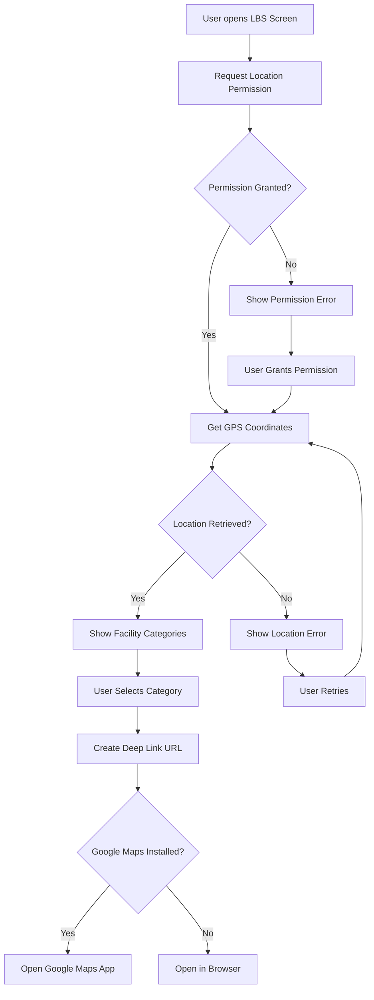

# Location-Based Service (LBS) Feature

## Overview

The LBS feature allows users to find nearby healthcare facilities (Rumah Sakit, Puskesmas, Posyandu, Apotek) using their device's GPS location and Google Maps.

**Validates Requirements:** 8.1, 8.2, 8.3, 8.4, 8.5, 8.6, 8.7

## Architecture

### Components

1. **LocationService** (`lib/core/services/location_service.dart`)
   - Handles GPS location access
   - Manages location permissions
   - Provides current coordinates

2. **MapsLauncherService** (`lib/core/services/maps_launcher_service.dart`)
   - Creates Google Maps deep link URLs
   - Opens Google Maps app or browser
   - Supports 4 facility categories

3. **LBSProvider** (`lib/presentation/providers/lbs_provider.dart`)
   - State management for location and errors
   - Coordinates between services
   - Handles loading states

4. **LBSScreen** (`lib/presentation/pages/lbs/lbs_screen.dart`)
   - UI with 4 facility category cards
   - Location display
   - Error handling UI

## Features

### Supported Facility Categories

| Category | Search Term | Icon | Color |
|----------|-------------|------|-------|
| Rumah Sakit | hospital | local_hospital | Red |
| Puskesmas | puskesmas | medical_services | Blue |
| Posyandu | posyandu | child_care | Green |
| Apotek | pharmacy | medication | Orange |

### Deep Link Strategy

The feature uses Google Maps deep links instead of embedding maps:

1. **Try Google Maps App First:**
   ```
   comgooglemaps://?q={category}&center={lat},{lng}
   ```

2. **Fallback to Browser:**
   ```
   https://www.google.com/maps/search/?api=1&query={category}+near+{lat},{lng}
   ```

**Benefits:**
- No Google Maps API key required
- No API usage costs
- Native Maps experience
- Automatic navigation features

## Usage

### Basic Integration

```dart
import 'package:provider/provider.dart';
import 'package:nutribunda/presentation/providers/lbs_provider.dart';
import 'package:nutribunda/presentation/pages/lbs/lbs_screen.dart';
import 'package:nutribunda/injection_container.dart';

// In your navigation or bottom nav bar:
ChangeNotifierProvider(
  create: (_) => sl<LBSProvider>(),
  child: const LBSScreen(),
)
```

### Standalone Navigation

```dart
Navigator.push(
  context,
  MaterialPageRoute(
    builder: (context) => ChangeNotifierProvider(
      create: (_) => sl<LBSProvider>(),
      child: const LBSScreen(),
    ),
  ),
);
```

### Bottom Navigation Integration

```dart
class MainNavigation extends StatefulWidget {
  @override
  State<MainNavigation> createState() => _MainNavigationState();
}

class _MainNavigationState extends State<MainNavigation> {
  int _currentIndex = 0;

  @override
  Widget build(BuildContext context) {
    return Scaffold(
      body: IndexedStack(
        index: _currentIndex,
        children: [
          HomeScreen(),
          DiaryScreen(),
          ChangeNotifierProvider(
            create: (_) => sl<LBSProvider>(),
            child: const LBSScreen(),
          ),
          ProfileScreen(),
        ],
      ),
      bottomNavigationBar: BottomNavigationBar(
        currentIndex: _currentIndex,
        onTap: (index) => setState(() => _currentIndex = index),
        items: const [
          BottomNavigationBarItem(icon: Icon(Icons.home), label: 'Home'),
          BottomNavigationBarItem(icon: Icon(Icons.book), label: 'Diary'),
          BottomNavigationBarItem(icon: Icon(Icons.map), label: 'Peta'),
          BottomNavigationBarItem(icon: Icon(Icons.person), label: 'Profil'),
        ],
      ),
    );
  }
}
```

## Platform Configuration

### Android (AndroidManifest.xml)

Already configured with:

```xml
<!-- Location permissions -->
<uses-permission android:name="android.permission.ACCESS_FINE_LOCATION"/>
<uses-permission android:name="android.permission.ACCESS_COARSE_LOCATION"/>

<!-- Query for Google Maps -->
<queries>
    <intent>
        <action android:name="android.intent.action.VIEW"/>
        <data android:scheme="geo"/>
    </intent>
    <intent>
        <action android:name="android.intent.action.VIEW"/>
        <data android:scheme="https"/>
    </intent>
</queries>
```

### iOS (Info.plist)

Already configured with:

```xml
<key>NSLocationWhenInUseUsageDescription</key>
<string>NutriBunda memerlukan akses lokasi untuk menemukan fasilitas kesehatan terdekat</string>

<key>NSLocationAlwaysUsageDescription</key>
<string>NutriBunda memerlukan akses lokasi untuk menemukan fasilitas kesehatan terdekat</string>

<key>LSApplicationQueriesSchemes</key>
<array>
    <string>comgooglemaps</string>
    <string>https</string>
</array>
```

## Error Handling

The feature handles various error scenarios:

### Permission Denied
- Shows message explaining permission is needed
- Provides button to retry permission request

### Permission Denied Forever
- Shows message about permanent denial
- Provides button to open app settings

### Location Service Disabled
- Shows message about GPS being disabled
- Provides button to open location settings

### Location Timeout
- Shows generic error message
- Provides retry button

### Maps Not Available
- Shows error when Maps can't be opened
- Suggests checking if Maps is installed

## User Flow



## Testing

### Manual Testing Checklist

- [ ] Location permission request appears on first use
- [ ] GPS coordinates are displayed correctly
- [ ] All 4 facility categories are visible
- [ ] Tapping category opens Google Maps (if installed)
- [ ] Fallback to browser works when Maps not installed
- [ ] Error messages appear for permission denial
- [ ] Settings button opens correct settings page
- [ ] Retry button works after errors
- [ ] Loading indicator shows during location fetch
- [ ] Location refresh button updates coordinates

### Test Scenarios

1. **Happy Path:**
   - Grant location permission
   - Verify coordinates displayed
   - Tap each facility category
   - Verify Maps opens with correct search

2. **Permission Denied:**
   - Deny location permission
   - Verify error message
   - Tap retry
   - Grant permission
   - Verify success

3. **GPS Disabled:**
   - Disable GPS in device settings
   - Open LBS screen
   - Verify error message
   - Tap settings button
   - Enable GPS
   - Return to app
   - Verify success

4. **No Maps App:**
   - Uninstall Google Maps
   - Tap facility category
   - Verify browser opens with Maps URL

## Requirements Validation

| Requirement | Implementation | Status |
|-------------|----------------|--------|
| 8.1 - Request location permission | LocationService.requestLocationPermission() | ✅ |
| 8.2 - Get GPS coordinates | LocationService.getCurrentLocation() | ✅ |
| 8.3 - Display 4 facility categories | LBSScreen grid with 4 cards | ✅ |
| 8.4 - Open Google Maps with query | MapsLauncherService.openMapsSearch() | ✅ |
| 8.5 - Format deep link with GPS | MapsLauncherService.createMapsSearchUrl() | ✅ |
| 8.6 - Fallback to browser | url_launcher with LaunchMode.externalApplication | ✅ |
| 8.7 - Guide to settings | LBSProvider.openAppSettings() / openLocationSettings() | ✅ |

## Dependencies

```yaml
dependencies:
  geolocator: ^13.0.2      # GPS location access
  url_launcher: ^6.3.1     # Open URLs and deep links
  provider: ^6.1.2         # State management
```

## Known Limitations

1. **No Offline Support:** Requires active internet for Maps to work
2. **No Distance Calculation:** Relies on Google Maps for distance/routing
3. **No Custom Markers:** Uses Google Maps default search results
4. **No In-App Maps:** Opens external Maps app/browser

## Future Enhancements

- [ ] Cache last known location for offline use
- [ ] Add distance calculation to facilities
- [ ] Show facility count in each category
- [ ] Add favorites/bookmarks for facilities
- [ ] Integrate with backend to store user's preferred facilities
- [ ] Add directions button for saved facilities

## Troubleshooting

### Location Not Working

1. Check device GPS is enabled
2. Check app has location permission
3. Check device has location services enabled
4. Try in open area with clear sky view

### Maps Not Opening

1. Check Google Maps is installed
2. Check internet connection
3. Check url_launcher permissions in manifest
4. Try browser fallback

### Permission Issues

1. Check AndroidManifest.xml has location permissions
2. Check Info.plist has location usage descriptions
3. Try uninstall/reinstall app to reset permissions
4. Check device settings for app permissions

## Support

For issues or questions:
1. Check this README
2. Review code comments in services
3. Check Flutter/Dart documentation
4. Review geolocator and url_launcher package docs
